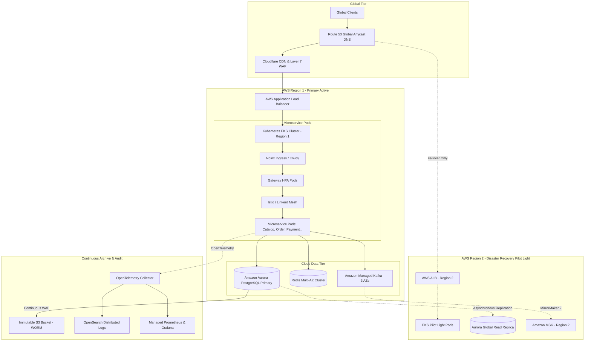

# Future Enterprise Scalability & Cloud Architecture Roadmap
**Architectural Evolution: Local Baseline vs. Enterprise Cloud Scale**  
*Document Version:* 1.0.0  
*Evaluation Date:* 2026-09-08  
*Target Strategy:* Cloud-Native Enterprise Production Migration  

---

## 1. Executive Summary

This document defines the architectural boundary between the **Current Platform Implementation** (a hardened, single-host containerized microservices platform) and the **Future Enterprise Scale Roadmap** (cloud-managed high availability, multi-region redundancy, and distributed data pipelines).

> [!IMPORTANT]
> **Scope Delineation:** The future capabilities described herein are documented for operational planning and architecture roadmap clarity. They are intentionally excluded from the local single-host Docker Compose scope to preserve repository simplicity and avoid artificial cloud dependencies.

---

## 2. Current Platform vs. Future Enterprise Scale

| Architectural Dimension | Current Platform (Implemented) | Future Enterprise Scale (Roadmap) | Migration Path & Technology |
|:------------------------|:------------------------------|:-----------------------------------|:----------------------------|
| **Compute Orchestration** | Docker Compose with container restart policies & resource constraints. | Kubernetes (EKS / GKE) with Horizontal Pod Autoscalers (HPA). | Create Helm charts; configure K8s HPA targeting CPU $> 70\%$ and HTTP latency $> 100$ ms. |
| **Edge & Ingress** | Standalone Nginx 1.25 Alpine reverse proxy terminating self-signed TLS. | Cloudflare / AWS CloudFront CDN + AWS Application Load Balancer (ALB). | DNS routing to Cloudflare CDN; ALB SSL termination with ACM certificates. |
| **API Protection & WAF** | Local IP rate limiting (50 conn/IP, 100 req/min burst) in Nginx & Express. | Distributed Cloud WAF with behavioral bot detection & Layer 7 DDoS mitigation. | Enable AWS WAF or Cloudflare Web Application Firewall with managed rule sets. |
| **PostgreSQL Persistence** | Single PostgreSQL 16 Alpine container with isolated service databases. | Amazon Aurora PostgreSQL Multi-AZ or Cloud SQL with Read Replicas. | Migrate to Aurora Multi-AZ with cross-AZ automated failover ($< 30$s RTO). |
| **Database Durability / PITR** | Periodic logical SQL exports (`pg_dump`) with SHA-256 integrity manifests. | Continuous Write-Ahead Log (WAL) streaming to S3 with microsecond PITR. | Deploy **pgBackRest** or **WAL-G** with continuous S3 archiving; near-zero RPO. |
| **Backup Storage** | Local filesystem directory (`backups/`) with non-destructive restore tools. | Versioned, encrypted, cross-region replicated AWS S3 bucket with Object Lock. | Automate S3 lifecycle transitions to S3 Glacier with WORM (Write Once, Read Many) compliance. |
| **Caching Tier** | Standalone Redis 7 container with LRU eviction and zero-trust DB fallback. | Multi-AZ Redis Cluster / Amazon ElastiCache with automatic primary-replica failover. | Deploy ElastiCache Redis Cluster with Multi-AZ replication and Redis Sentinel. |
| **Event Mesh (Kafka)** | Single Confluent Kafka broker with `ReplicationFactor = 1` + ZooKeeper. | 3-Broker Apache Kafka cluster across 3 Availability Zones (`RF=3`, `min.isr=2`). | Deploy AWS MSK (Managed Streaming for Kafka) or Confluent Cloud Enterprise. |
| **Schema Governance** | In-process JavaScript envelope validation (`KafkaEventEnvelope` v1). | Confluent / Apicurio Centralized Schema Registry with binary Avro/Protobuf serialization. | Integrate Schema Registry client; compile Avro schemas into TypeScript/JS interfaces. |
| **Secret Management** | Local `.env` files with strict `.gitignore` and template documentation. | Cloud KMS, HashiCorp Vault, or AWS Secrets Manager with automatic rotation. | Replace environment file parsing with Vault Agent or AWS Secrets Manager SDK. |
| **Logging & Tracing** | Structured JSON stdout via `pino` with request-id propagation. | Centralized log ingestion (OpenSearch / Loki) + distributed tracing (OpenTelemetry / Jaeger). | Deploy OpenTelemetry Collector DaemonSet forwarding spans to Tempo and logs to Loki. |
| **Search & Analytics** | PostgreSQL compound index lookups & SQL `ILIKE` queries. | Dedicated Elasticsearch / OpenSearch cluster for full-text search & catalog facets. | Implement Change Data Capture (Debezium) streaming product mutations to Elasticsearch. |
| **Query Architecture (CQRS)** | Direct database queries against service operational datastores. | Command Query Responsibility Segregation (CQRS) with optimized read models. | Materialize read-optimized denormalized views into Redis/MongoDB via Kafka event subscribers. |
| **Disaster Recovery** | Single-region local reconstruction scripts with measured 26.79s local RTO. | Multi-Region Active/Passive "Pilot Light" or Active/Active multi-region replication. | Cross-region Aurora global databases with Route 53 health-checked DNS failover. |

---

## 3. Detailed Enterprise Architecture Evolution

---

## 4. Prioritized Engineering Roadmap

### Phase A: Cloud Infrastructure Foundation (Weeks 1–4)
1. **Container Orchestration**: Transition Docker Compose configurations into modular **Helm Charts** targeting Kubernetes 1.29+.
2. **Managed Persistence**: Provision **Amazon Aurora PostgreSQL Multi-AZ** and **AWS ElastiCache Redis** using Terraform / OpenTofu.
3. **Managed Streaming**: Provision **Amazon MSK** (3 brokers across 3 AZs, `ReplicationFactor = 3`, `min.insync.replicas = 2`).

### Phase B: Zero-Trust Security & Secret Hardening (Weeks 5–8)
1. **Vault Integration**: Connect microservices to **HashiCorp Vault** or **AWS Secrets Manager** via IAM Roles for Service Accounts (IRSA), eliminating on-disk `.env` files.
2. **Automated TLS**: Deploy **cert-manager** inside Kubernetes with Let's Encrypt ACME automated certificate renewal.
3. **Cloud WAF**: Provision **AWS WAF** with rate-based blocking rules, SQL injection inspection, and known IP reputation lists.

### Phase C: Continuous Durability & Near-Zero RPO (Weeks 9–12)
1. **Continuous WAL Streaming**: Configure PostgreSQL continuous archiving via **pgBackRest** streaming Write-Ahead Logs to an encrypted S3 bucket.
2. **Point-In-Time Recovery (PITR)**: Enable microsecond-level rollback capability achieving **RPO $\le 5$ minutes** and **RTO $\le 15$ minutes**.
3. **Cross-Region S3 Replication**: Replicate backup snapshots to a secondary cloud region with S3 Object Lock (immutable WORM compliance).

### Phase D: Extreme Scale & Read Model Optimization (Weeks 13–16)
1. **Change Data Capture (CDC)**: Deploy **Debezium** connectors on Kafka Connect to stream transactional changes directly from PostgreSQL WAL logs, bypassing polling outbox workers.
2. **Dedicated Search Indexing**: Stream catalog mutations to an **OpenSearch** cluster, offloading complex filtering and full-text search from PostgreSQL.
3. **CQRS Read Projections**: Materialize customer order history and dashboard analytics into fast, denormalized read stores.

---

## 5. Summary

The current platform codebase represents a rock-solid, hardened foundation. Its strict modularity, Database-per-Service boundary enforcement, idempotency, and transactional outbox pattern ensure that migrating to enterprise-scale cloud infrastructure requires **zero rewrites of domain business logic**—only the replacement of local container adapters with their managed cloud counterparts.
