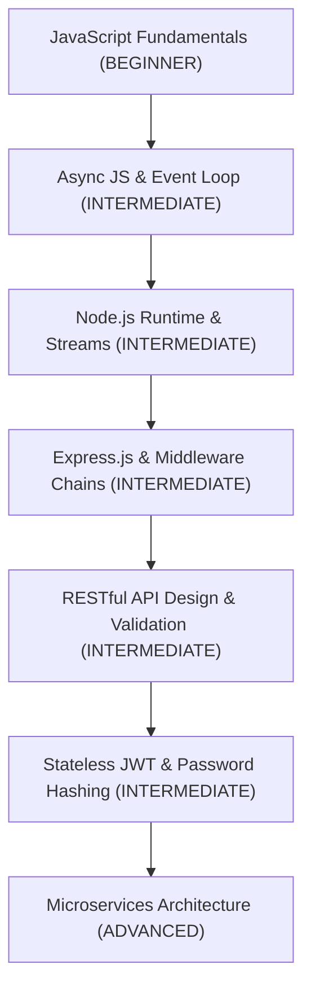
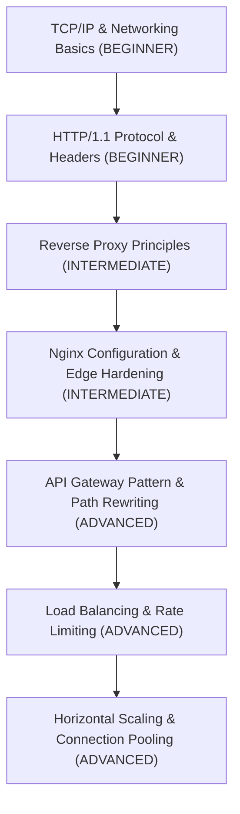
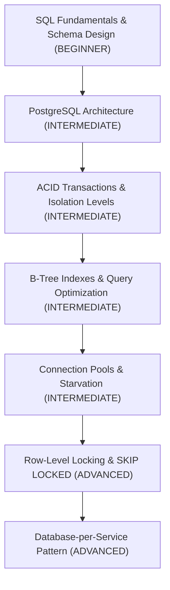
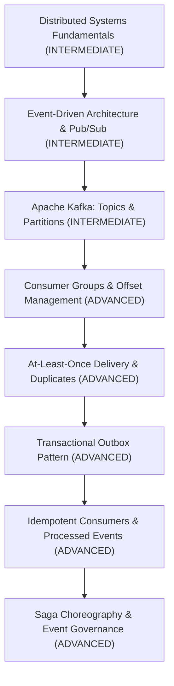
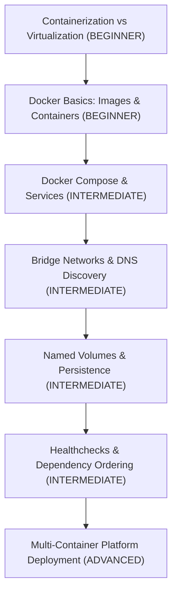

# E-Commerce Platform — Learning Prerequisites Tree

> **Architectural Learning Path & Competency Prerequisite Guide**  
> *Target Audience*: Developers progressing from ~20% knowledge to full senior engineering mastery of this codebase.  
> *Grounded in*: [`ecommerce-platform/`](file:///c:/Users/The%20Mighty%20King/Desktop/E-Commerce/ecommerce-platform/)

---

## 1. Executive Summary & Mandatory Baseline

This repository is an enterprise-grade distributed e-commerce backend. To prevent cognitive overload, topics are organized into progressive learning tracks.

### Mandatory Before You Proceed to Code:
1. **JavaScript ES Modules & Asynchronous Programming** (`async`/`await`, Promises, Event Loop)
2. **HTTP Fundamentals & REST Conventions** (Methods, Status Codes, Headers, JSON payloads)
3. **Basic SQL & Relational Tables** (Tables, Primary Keys, Foreign Keys, `SELECT`, `INSERT`, `UPDATE`)
4. **Basic Docker Concepts** (What is a container? What is an image? What does port mapping mean?)

### Can Be Learned Incrementally as You Reach Specific Subsystems:
1. **Kafka internals** (Partitions, Consumer Groups, Offsets, Lag, DLQ)
2. **PostgreSQL Concurrency** (Row locks, `SELECT ... FOR UPDATE SKIP LOCKED`, Isolation levels)
3. **Distributed Resiliency** (Circuit breakers, bulkheads, load shedding, exponential backoff)
4. **Disaster Recovery & Cryptographic Verification** (SHA-256 manifests, point-in-time recovery)

---

## 2. Comprehensive Prerequisite Trees

### Tree A: Application & Backend Development Track

* **JavaScript Fundamentals** — `BEGINNER` *(MANDATORY FIRST)*
  * *Concepts*: Variables, functions, objects, arrays, closures, arrow functions, ES module syntax (`import`/`export`).
  * *Where used in project*: Every `.js` file across [`services/`](file:///c:/Users/The%20Mighty%20King/Desktop/E-Commerce/ecommerce-platform/services/) and [`packages/`](file:///c:/Users/The%20Mighty%20King/Desktop/E-Commerce/ecommerce-platform/packages/).
* **Async JavaScript & Event Loop** — `INTERMEDIATE` *(MANDATORY)*
  * *Concepts*: Microtasks (Promises), macrotasks (`setTimeout`, I/O events), non-blocking execution, `async`/`await`, unhandled rejections.
  * *Where used in project*: All asynchronous database queries, Redis caching calls, and Kafka event handling.
* **Node.js Runtime** — `INTERMEDIATE` *(MANDATORY)*
  * *Concepts*: Process environment (`process.env`), standard I/O streams, buffer manipulation, signal handlers (`SIGTERM`, `SIGINT`).
  * *Where used in project*: Service startup & graceful shutdown scripts ([`services/gateway/src/server.js`](file:///c:/Users/The%20Mighty%20King/Desktop/E-Commerce/ecommerce-platform/services/gateway/src/server.js)).
* **Express.js & Middleware Chains** — `INTERMEDIATE` *(MANDATORY)*
  * *Concepts*: Routing, middleware pipeline `(req, res, next)`, error handling middleware `(err, req, res, next)`.
  * *Where used in project*: Rate limiting, authentication verification, correlation tracking ([`packages/shared/src/middleware/`](file:///c:/Users/The%20Mighty%20King/Desktop/E-Commerce/ecommerce-platform/packages/shared/src/middleware/)).
* **RESTful API Design & Validation** — `INTERMEDIATE` *(MANDATORY)*
  * *Concepts*: HTTP methods (`GET`, `POST`, `PUT`, `DELETE`, `PATCH`), idempotent methods, standard status codes (200, 201, 400, 401, 403, 404, 409, 500, 503).
  * *Where used in project*: All service controllers and API documentation ([`docs/POSTMAN_API_TESTING_GUIDE.md`](file:///c:/Users/The%20Mighty%20King/Desktop/E-Commerce/ecommerce-platform/docs/POSTMAN_API_TESTING_GUIDE.md)).
* **Stateless JWT & Password Hashing** — `INTERMEDIATE` *(MANDATORY)*
  * *Concepts*: HMAC SHA-256 digital signatures, JWT claims (`sub`, `role`, `exp`), salt rounds, bcrypt adaptive one-way hash.
  * *Where used in project*: User registration/login in [`services/identity-svc`](file:///c:/Users/The%20Mighty%20King/Desktop/E-Commerce/ecommerce-platform/services/identity-svc) and verification in [`services/gateway`](file:///c:/Users/The%20Mighty%20King/Desktop/E-Commerce/ecommerce-platform/services/gateway).
* **Microservices Architecture** — `ADVANCED` *(LEARN IN STAGE 3)*
  * *Concepts*: Domain boundaries, single responsibility, decoupled deployment, network latency over IPC, distributed state challenges.
  * *Where used in project*: System-wide service separation.

---

### Tree B: Networking, Edge Proxy & Gateway Track

* **TCP/IP & Networking Basics** — `BEGINNER` *(MANDATORY)*
  * *Concepts*: IP addresses, ports (e.g. 80, 443, 3000, 5432, 6379, 9092), sockets, DNS lookup, loopback interface (`localhost` / `127.0.0.1`).
  * *Where used in project*: Container port mappings and service-to-service communication.
* **HTTP/1.1 Protocol & Headers** — `BEGINNER` *(MANDATORY)*
  * *Concepts*: Request/response framing, standard headers (`Host`, `Authorization`, `Content-Type`), connection keep-alive.
  * *Where used in project*: All API interactions between clients, Nginx, and Gateway.
* **Reverse Proxy Principles** — `INTERMEDIATE` *(LEARN IN STAGE 3)*
  * *Concepts*: Forward proxy vs reverse proxy, SSL/TLS termination, hiding internal network topology, request forwarding.
  * *Where used in project*: Nginx edge proxy ([`infra/nginx/nginx.conf`](file:///c:/Users/The%20Mighty%20King/Desktop/E-Commerce/ecommerce-platform/infra/nginx/nginx.conf)).
* **Nginx Configuration & Edge Hardening** — `INTERMEDIATE` *(LEARN IN STAGE 3)*
  * *Concepts*: Directives, upstream blocks, client body size limits (`client_max_body_size 10m`), rate-limiting zones (`limit_req_zone`).
  * *Where used in project*: Edge security and proxying in [`infra/nginx/conf.d/default.conf`](file:///c:/Users/The%20Mighty%20King/Desktop/E-Commerce/ecommerce-platform/infra/nginx/conf.d/default.conf).
* **API Gateway Pattern & Path Rewriting** — `ADVANCED` *(LEARN IN STAGE 4)*
  * *Concepts*: Unified public endpoint, token validation at the edge, request correlation ID generation, proxying to private downstream microservices.
  * *Where used in project*: [`services/gateway/src/routes/proxy.routes.js`](file:///c:/Users/The%20Mighty%20King/Desktop/E-Commerce/ecommerce-platform/services/gateway/src/routes/proxy.routes.js).
* **Load Balancing & Rate Limiting** — `ADVANCED` *(LEARN IN STAGE 8)*
  * *Concepts*: Round-robin, least connections, sliding window counters, token bucket algorithms, HTTP 429 Too Many Requests.
  * *Where used in project*: Gateway Redis rate limiter ([`services/gateway/src/middleware/rate-limiter.js`](file:///c:/Users/The%20Mighty%20King/Desktop/E-Commerce/ecommerce-platform/services/gateway/src/middleware/rate-limiter.js)).

---

### Tree C: Relational Database & Concurrency Track

* **SQL Fundamentals & Schema Design** — `BEGINNER` *(MANDATORY)*
  * *Concepts*: Tables, columns, datatypes (UUID, VARCHAR, TIMESTAMP, DECIMAL), primary keys, foreign keys, unique constraints.
  * *Where used in project*: [`infra/postgres/init-databases.sql`](file:///c:/Users/The%20Mighty%20King/Desktop/E-Commerce/ecommerce-platform/infra/postgres/init-databases.sql) and Prisma schemas.
* **PostgreSQL Architecture** — `INTERMEDIATE` *(LEARN IN STAGE 6)*
  * *Concepts*: Client-server model, Write-Ahead Log (WAL), data pages, shared buffers, background writer.
  * *Where used in project*: PostgreSQL 16 container and database backup scripts.
* **ACID Transactions & Isolation Levels** — `INTERMEDIATE` *(LEARN IN STAGE 6)*
  * *Concepts*: Atomicity, Consistency, Isolation, Durability. Dirty reads, non-repeatable reads, phantom reads. `READ COMMITTED` default.
  * *Where used in project*: Multi-table checkout transactions in `order-svc` and `payment-svc`.
* **B-Tree Indexes & Query Optimization** — `INTERMEDIATE` *(LEARN IN STAGE 6)*
  * *Concepts*: Clustered vs non-clustered indexes, composite indexes, query execution plans (`EXPLAIN ANALYZE`), avoiding full table scans.
  * *Where used in project*: Product lookup indexes, order lookup by user ID, outbox status indexes.
* **Connection Pools & Pool Exhaustion** — `INTERMEDIATE` *(LEARN IN STAGE 6)*
  * *Concepts*: Connection acquisition overhead, pool sizing formula (`connections = ((core_count * 2) + effective_spindle_count)`), pool queue timeouts.
  * *Where used in project*: Prisma connection pool settings and node-postgres pools.
* **Row-Level Locking & `SKIP LOCKED`** — `ADVANCED` *(LEARN IN STAGE 7)*
  * *Concepts*: Pessimistic concurrency control, `SELECT ... FOR UPDATE`, non-blocking queue consumption with `SKIP LOCKED`.
  * *Where used in project*: Transactional Outbox worker ([`packages/shared/src/kafka/transactional-outbox.js`](file:///c:/Users/The%20Mighty%20King/Desktop/E-Commerce/ecommerce-platform/packages/shared/src/kafka/transactional-outbox.js)).
* **Database-per-Service Pattern** — `ADVANCED` *(LEARN IN STAGE 3)*
  * *Concepts*: Loose coupling, independent schema evolution, preventing shared database deadlocks and accidental tight coupling.
  * *Where used in project*: 6 separate databases (`identity_db`, `catalog_db`, `order_db`, `payment_db`, `fulfillment_db`, `notification_db`).

---

### Tree D: Distributed Systems, Kafka & Event Governance Track

* **Distributed Systems Fundamentals** — `INTERMEDIATE` *(LEARN IN STAGE 7)*
  * *Concepts*: Network unreliability (fallacies of distributed computing), latency, partial failures, CAP theorem, eventual consistency.
  * *Where used in project*: Service-to-service communication and asynchronous messaging.
* **Event-Driven Architecture & Pub/Sub** — `INTERMEDIATE` *(LEARN IN STAGE 7)*
  * *Concepts*: Producers, consumers, message brokers, topics, loose temporal coupling.
  * *Where used in project*: Asynchronous order fulfillment and notifications.
* **Apache Kafka: Topics & Partitions** — `INTERMEDIATE` *(LEARN IN STAGE 7)*
  * *Concepts*: Commit log, partitions as units of parallelism and ordering, partition keys, offsets.
  * *Where used in project*: 6 platform topics configured in Kafka ([`docs/events/EVENT-CATALOG.md`](file:///c:/Users/The%20Mighty%20King/Desktop/E-Commerce/ecommerce-platform/docs/events/EVENT-CATALOG.md)).
* **Consumer Groups & Offset Management** — `ADVANCED` *(LEARN IN STAGE 7)*
  * *Concepts*: Consumer group rebalancing, heartbeat threads, consumer lag, manual vs automatic offset committing.
  * *Where used in project*: Consumer subscribers in `payment-svc`, `fulfillment-svc`, `notification-svc`.
* **At-Least-Once Delivery & The Dual-Write Problem** — `ADVANCED` *(LEARN IN STAGE 7)*
  * *Concepts*: Why publishing to Kafka and writing to a database in the same HTTP handler can fail halfway; duplicate message delivery.
  * *Where used in project*: Addressed directly by the Transactional Outbox pattern.
* **Transactional Outbox Pattern** — `ADVANCED` *(LEARN IN STAGE 7)*
  * *Concepts*: Writing domain entity and event record within the same local ACID transaction; background poller forwarding to Kafka.
  * *Where used in project*: [`packages/shared/src/kafka/transactional-outbox.js`](file:///c:/Users/The%20Mighty%20King/Desktop/E-Commerce/ecommerce-platform/packages/shared/src/kafka/transactional-outbox.js).
* **Idempotent Consumers & Processed Events** — `ADVANCED` *(LEARN IN STAGE 7)*
  * *Concepts*: Idempotency keys, checking processed events table before execution, preventing duplicate financial charges.
  * *Where used in project*: `processed_events` table in all consuming services.
* **Saga Choreography & Event Governance** — `ADVANCED` *(LEARN IN STAGE 7 & 10)*
  * *Concepts*: Multi-service distributed workflows via events; schema versioning rules, tolerant reader pattern, Dead Letter Queue (DLQ).
  * *Where used in project*: Order creation -> Payment authorized -> Fulfillment prepared lifecycle ([`docs/events/EVENT-VERSIONING.md`](file:///c:/Users/The%20Mighty%20King/Desktop/E-Commerce/ecommerce-platform/docs/events/EVENT-VERSIONING.md)).

---

### Tree E: Containers & Infrastructure Orchestration Track

* **Containerization vs Virtualization** — `BEGINNER` *(MANDATORY)*
  * *Concepts*: OS-level virtualization, namespaces, cgroups, why containers are lightweight compared to Virtual Machines.
  * *Where used in project*: Foundation of local execution.
* **Docker Basics: Images & Containers** — `BEGINNER` *(MANDATORY)*
  * *Concepts*: Dockerfile instructions (`FROM`, `WORKDIR`, `COPY`, `RUN`, `CMD`), container lifecycle (`run`, `stop`, `ps`, `logs`).
  * *Where used in project*: Service Dockerfiles across `services/*/Dockerfile`.
* **Docker Compose & Services** — `INTERMEDIATE` *(MANDATORY)*
  * *Concepts*: `docker-compose.yml` specification, multi-service declaration, environment variables injection via `.env`.
  * *Where used in project*: [`infra/docker-compose.yml`](file:///c:/Users/The%20Mighty%20King/Desktop/E-Commerce/ecommerce-platform/infra/docker-compose.yml).
* **Bridge Networks & DNS Discovery** — `INTERMEDIATE` *(MANDATORY)*
  * *Concepts*: Internal bridge network (`ecommerce-net`), embedded Docker DNS resolver (resolving `postgres`, `redis`, `kafka` container hostnames).
  * *Where used in project*: Container-to-container internal communication.
* **Named Volumes & Persistence** — `INTERMEDIATE` *(MANDATORY)*
  * *Concepts*: Ephemeral container filesystems vs persistent volumes (`postgres_data`, `redis_data`, `kafka_data`).
  * *Where used in project*: Data durability across container restarts.
* **Healthchecks & Dependency Ordering** — `INTERMEDIATE` *(LEARN IN STAGE 3)*
  * *Concepts*: Container healthcheck scripts (`pg_isready`, `redis-cli ping`), `depends_on` conditions (`service_healthy`).
  * *Where used in project*: Safe startup order in Docker Compose and DR reconstruction.

---

## 3. Self-Assessment Matrix

Rate your current familiarity with each track from 1 to 5:

| Track | Baseline Target | Where to Focus First |
| :--- | :--- | :--- |
| **Track A: App & Backend** | Level 3 (Express/Node) | Focus on Promises, async/await, and middleware execution. |
| **Track B: Edge & Gateway** | Level 2 (HTTP/Ports) | Understand port 80/443 (Nginx) forwarding to port 3000 (Gateway). |
| **Track C: Database & SQL** | Level 3 (Tables/Queries) | Learn why each service has its own DB and what an ACID transaction is. |
| **Track D: Kafka & Events** | Level 1 -> 2 (Queues) | Start with producer/consumer concept before studying partitions/outbox. |
| **Track E: Containers** | Level 2 (Docker Run) | Learn how container names become hostnames on Docker networks. |
