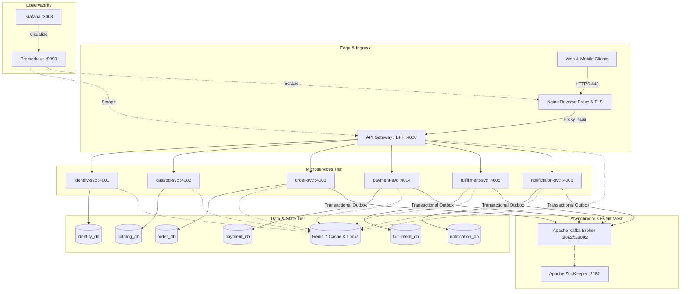
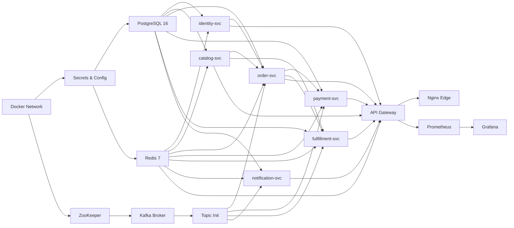
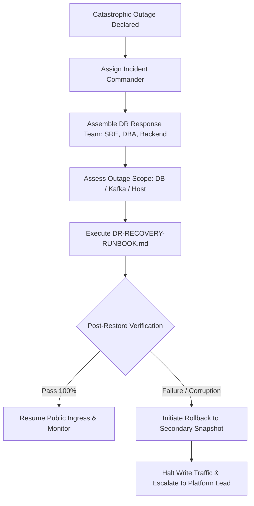

# Disaster Recovery & Platform Reconstruction Strategy
**Phase 12: Production-Oriented Disaster Recovery Specification**  
*Document Version:* 1.0.0  
*Evaluation Date:* 2026-09-08  
*Target Architecture:* Single-Host Containerized Microservices Platform  
*Status:* PASS WITH LIMITATIONS  

---

## 1. Architecture Overview

The platform operates as a modular, containerized e-commerce system adhering strictly to the **Database-per-Service** and **Event-Driven Transactional Outbox** architecture patterns.



### Core Architecture Components
1. **Edge & Ingress**: Nginx 1.25 reverse proxy terminating TLS, enforcing request rate limits, connection limits, and routing to the API Gateway (`:4000`) and frontend web apps.
2. **API Gateway / BFF**: Centralized authentication verification, request forwarding, load shedding, and Redis-backed sliding-window rate limiting.
3. **Domain Microservices (6 services)**:
   - `identity-svc`: User identity, credential hashing, seller profiles, JWT validation.
   - `catalog-svc`: Product categories, products, inventory views, reviews.
   - `order-svc`: Cart management, checkout state machine, transactional order outbox.
   - `payment-svc`: Payment intent handling, signature verification, refunds, outbox.
   - `fulfillment-svc`: Warehouse allocation, shipments, return pickups, outbox.
   - `notification-svc`: Email/SMS templating and customer notifications.
4. **Data Persistence**: PostgreSQL 16 isolated databases per service (`identity_db`, `catalog_db`, `order_db`, `payment_db`, `fulfillment_db`, `notification_db`).
5. **Caching & Locks**: Redis 7 Alpine used for volatile response caching, distributed mutex locking (`redlock` semantics), and rate-limiting buckets.
6. **Event Mesh**: Apache Kafka 7.6.1 + ZooKeeper 7.6.1 with 6 standardized business topics, transactional outbox worker polling (`FOR UPDATE SKIP LOCKED`), idempotent consumers, and Dead Letter Queues (DLQ).
7. **Observability**: Prometheus 2.51.0 metrics scraping and Grafana 10.4.0 dashboards and alerting rules.

---

## 2. Disaster Assumptions

A catastrophic platform disaster is defined as an unforeseen disruption that impairs data integrity, compute availability, or core transactional flows:
1. **Complete Host / Container Failure**: The Docker host experiences unrecoverable hardware, kernel, or daemon termination.
2. **Authoritative Storage Corruption**: PostgreSQL data files on the host storage volume are corrupted, accidentally deleted, or rendered unreadable.
3. **Event Mesh Collapse**: Kafka broker or ZooKeeper storage failure causing partition loss or consumer metadata corruption.
4. **Cache / Ephemeral Store Eviction**: Redis instance termination or memory wipeout.
5. **Configuration & Secret Wipeout**: Loss of environment files (`.env`) or internal service signing keys.

---

## 3. Recovery Boundaries

The disaster recovery strategy strictly separates what must be restored from persistent immutable archives versus what can be autonomously rebuilt:

| Component | Recovery Boundary | Mechanism | Authoritative Source |
|:----------|:------------------|:----------|:---------------------|
| **PostgreSQL Databases** | **MUST RESTORE** | Cryptographic SHA-256 Logical SQL Snapshots (`pg_dump`) | Verified Backup Archives (`backups/`) |
| **Transactional Outbox Records** | **RESTORED WITH DB** | Restored as part of `*_outbox` tables; drained post-recovery | Restored PostgreSQL tables |
| **Kafka Topics & Partitions** | **RECREATED & REPLAYED** | Auto-created via `initializeKafkaTopics()` (3 partitions, RF=1) | Outbox Workers republishing pending/un-acked events |
| **Redis Cache & Locks** | **EPHEMERAL / REBUILT** | Cold start; caches warm on demand; locks expire naturally | PostgreSQL (DB is source of truth for all business state) |
| **Secrets & Environment** | **RECONSTRUCTED** | Operator-injected environment secrets / vault recovery | Secure Vault / Offline Secret Runbook |
| **Container Runtimes** | **RE-PROVISIONED** | Container images rebuilt/pulled via Docker Compose | Docker Registry / Git Repository |
| **Observability Data** | **EPHEMERAL TSDB** | Prometheus TSDB cold start; metrics begin scraping fresh | Real-time service `/metrics` endpoints |

---

## 4. Critical Dependencies

Recovery requires adherence to strict inter-service and infrastructural dependencies:



---

## 5. Recovery Objectives (RPO & RTO Policy)

Recovery objectives are strictly categorized into **MEASURED LOCAL BENCHMARKS** (derived from actual empirical tests in this repository) and **PRODUCTION TARGETS** (standards for cloud production deployments).

> [!IMPORTANT]
> **Engineering Benchmark vs. Production SLA**  
> The observed local recovery timings are empirical measurements conducted on local containerized NVMe storage under non-loaded conditions. They serve as engineering benchmarks and **must not** be represented as contractual production cloud SLAs.

### RPO & RTO Specification Table

| Metric | Tier | Specification / Observed | Implementation Baseline | Technical Rationale |
|:-------|:-----|:-------------------------|:------------------------|:--------------------|
| **RPO (Target)** | PRODUCTION TARGET | $\le$ 15–60 minutes | Scheduled cron snapshot | Maximum acceptable data loss window using periodic logical SQL dumps. |
| **RPO (WAL Target)** | PRODUCTION TARGET | $\le$ 5 minutes | Continuous WAL Archiving | Continuous stream to object storage (e.g. S3 with `pgBackRest`). |
| **RPO (Observed Local)** | MEASURED LOCAL | **3m 00s** | Measured Snapshot Delta | Time delta between snapshot generation and simulated disaster event. |
| **RTO (Target)** | PRODUCTION TARGET | $\le$ 60 minutes | Full Disaster Recovery SLA | End-to-end duration from incident declaration to public traffic readiness. |
| **RTO (Observed Local)**| MEASURED LOCAL | **26.79 seconds** | Phase 12 Reconstruction Exercise | Full automated recovery duration: DB restore (6.68s) + Service init + Kafka + Smoke tests. |
| **RTO (Phase 8 Baseline)**| MEASURED LOCAL | **17.65 seconds** | Phase 8 Master Suite | Isolated container restore and row-count verification benchmark. |

---

## 6. Recovery Order & Rationale

The platform must be reconstructed in the following strict sequential phases:

1. **Host & Network Initialization**:
   - *Action*: Ensure host OS Docker daemon is running and bridge network (`infra_ecommerce-net` / `ecommerce-net`) is created.
   - *Rationale*: Inter-container DNS resolution and service mesh networking require the shared Docker bridge network.
2. **Secrets & Configuration Injection**:
   - *Action*: Validate `.env` variables (database URLs, JWT keys, internal secrets).
   - *Rationale*: Prevents crash loops caused by missing environment bindings at container bootstrap.
3. **Authoritative Database Tier (PostgreSQL 16)**:
   - *Action*: Start PostgreSQL container, initialize catalogs (`init-databases.sql`), restore verified logical SQL dumps across all 6 databases, validate row counts and relational integrity.
   - *Rationale*: Microservices fail dependency-aware readiness probes immediately if their backing database is inaccessible.
4. **Cache & Mutex Tier (Redis 7)**:
   - *Action*: Start Redis container, verify `PING`, verify lock acquisition.
   - *Rationale*: Required by Gateway for distributed rate limiting and by microservices for deduplication locks.
5. **Coordination & Message Broker Tier (ZooKeeper $\to$ Kafka Broker)**:
   - *Action*: Start ZooKeeper, await healthcheck (`echo srvr | nc`), start Kafka broker, verify listener ports (`29092` internal, `9092` external).
   - *Rationale*: Kafka depends on ZooKeeper for cluster metadata; microservices crash or fail health checks if Kafka broker is unavailable.
6. **Kafka Topic & Partition Topology Initialization**:
   - *Action*: Execute topic verification/creation ensuring all 6 topics exist with exactly 3 partitions and RF=1.
   - *Rationale*: Prevents message loss or consumer group rebalance errors during service bootstrap.
7. **Core Domain Microservices Tier**:
   - *Order*:
     1. `identity-svc` (Auth, JWT keys, user profiles)
     2. `catalog-svc` (Categories, products, read by Order and Fulfillment)
     3. `order-svc` (Depends on Identity and Catalog)
     4. `payment-svc` (Depends on Order)
     5. `fulfillment-svc` (Depends on Order and Catalog)
     6. `notification-svc` (Asynchronous event handler)
   - *Rationale*: Follows domain dependencies; upstream catalog and identity services must be live before order validation endpoints can function.
8. **Edge & Ingress Tier (API Gateway $\to$ Frontends $\to$ Nginx)**:
   - *Action*: Start Gateway (`:4000`), frontend containers, and Nginx reverse proxy (`:80`, `:443`).
   - *Rationale*: Gateway requires downstream service URLs to pass aggregated health probes; Nginx requires upstream Gateway and web apps before routing client traffic.
9. **Observability Tier (Prometheus $\to$ Grafana)**:
   - *Action*: Start Prometheus scraper (`:9090`) and Grafana visualizer (`:3003`).
   - *Rationale*: Provides immediate visibility into recovery metrics, database connection pools, and consumer lag.
10. **Validation, Smoke Testing & Outbox Catch-up**:
    - *Action*: Run synthetic smoke tests and monitor Kafka consumer lag until it reaches zero.

---

## 7. Database Recovery

PostgreSQL recovery strictly reuses the hardened tooling implemented in Phase 8:
- **Backup Identification**: Located in timestamped directories under `backups/YYYY-MM-DD_HH-mm-ss/`.
- **Integrity Pre-Check**: Before applying SQL, `verify-backups.mjs` validates the JSON schema of `manifest.json` and computes SHA-256 cryptographic hashes for each of the 6 `.sql` dump files. If any hash differs by even 1 byte, restoration is halted immediately.
- **Safety Guardrails (`validateRestoreSafety`)**:
  - Restores unconditionally reject `NODE_ENV=production`.
  - Rejects remote or external hostnames.
  - Requires the explicit `--confirm-restore` flag.
  - By default, restores are directed into an isolated disposable container (`ecommerce-postgres-restore`) to verify integrity before promoting to live traffic.
- **Data Invariant Verification**: `verify-restore.mjs` inspects 27 entity tables across the 6 databases, comparing post-restore counts with pre-backup baselines and verifying that no orphan records or corrupt foreign keys exist.

---

## 8. Kafka Recovery

- **Broker Startup**: ZooKeeper initializes first, followed by Kafka with listener mapping (`PLAINTEXT://kafka:29092,PLAINTEXT_HOST://localhost:9092`).
- **Topic Configuration**:
  - `ecommerce.order-events` (3 partitions)
  - `ecommerce.payment-events` (3 partitions)
  - `ecommerce.fulfillment-events` (3 partitions)
  - `ecommerce.notification-events` (3 partitions)
  - `ecommerce.dead-letter-events` (3 partitions)
  - `ecommerce.review-events` (3 partitions)
- **Local Environment Constraints**: Local single-broker architecture uses `ReplicationFactor = 1`. In a cloud environment, this is upgraded to `ReplicationFactor = 3` across multiple Availability Zones.
- **Offset & Consumer Recovery**: Consumer groups connect with `autoCommit: false`. Offset commits are executed only after successful transactional processing or routing to the Dead Letter Queue (DLQ).

---

## 9. Redis Recovery

The platform adheres strictly to **Zero-Trust Cache Resilience**:
- **Authoritative vs. Ephemeral Data**: PostgreSQL is the sole authoritative source of persistent business state. Redis stores disposable read caches, sliding-window rate limit counters, and short-lived distributed mutexes (`lockTimeoutMs: 30000`).
- **Cold-Start Resilience**: When Redis recovers empty, microservices automatically fall back to querying PostgreSQL directly (`getOrSet()` pattern) without dropping requests.
- **Distributed Mutex Handling**: All distributed locks have deterministic Time-To-Live (TTL) expiries, preventing permanent deadlocks if a container fails while holding a lock.

---

## 10. Microservice Recovery & Health Probes

All microservices implement dual-probe semantics:
1. **/liveness**:
   - Checks that the Node.js event loop is responsive and the HTTP process is running.
   - Does **not** fail merely because downstream dependencies or Kafka are temporarily unreachable during disaster recovery.
2. **/ready**:
   - Evaluates active connectivity to dependent resources:
     - PostgreSQL database pool (`SELECT 1`)
     - Redis cache ping (`redis.ping()`)
     - Kafka broker connectivity (`kafkaClient.checkHealth()`)
   - Returns HTTP `503 Service Unavailable` with detailed sub-check statuses until all dependencies are confirmed.

---

## 11. Gateway / Nginx Recovery

- **Nginx Hardening**: Reuses Phase 9 configuration terminating TLS on port 443 with modern cipher suites (`ECDHE-ECDSA-AES128-GCM-SHA256`, etc.) and enforcing HTTP-to-HTTPS 301 redirects on port 80.
- **Security Headers**: Injects `Strict-Transport-Security`, `X-Frame-Options: SAMEORIGIN`, `X-Content-Type-Options: nosniff`, and strips externally supplied internal mesh headers (`X-Internal-Gateway-Secret`, `X-User-Id`).
- **SSE Streaming Route**: Specialized unbuffered proxy configuration for `/api/v1/notifications/stream` disabling chunked encoding and setting keepalive timeout to 3600s.
- **Certificate Status**: Local environment uses self-signed development certificates (`infra/nginx/certs/`). Production cloud deployment requires ACME/Let's Encrypt automated lifecycle management.

---

## 12. Observability Recovery

Observability is an essential recovery validation component:
- **Prometheus (`:9090`)**:
  - Scrapes `/metrics` endpoints across Gateway (`:4000`), Nginx, and all microservices.
  - Verifies database pool saturation, Redis cache hits/misses, Kafka consumer lag, and HTTP request durations.
- **Grafana (`:3003`)**:
  - Auto-provisions dashboards for System Overview, Kafka Lag, Database Health, and Load Shedding.
  - Validates active alerting rules (`ServiceDown`, `HighConsumerLag`, `DatabaseConnectionSaturation`).

---

## 13. Configuration & Secrets Recovery

### Configuration Sources
All services read configuration from environment variables defined in `.env`.

> [!CAUTION]
> **Secret Hygiene:** Never commit real secrets or production credentials to source control or documentation. Use placeholders only.

### Key Environment Configuration
```env
# Infrastructure Mesh
INTERNAL_GATEWAY_SECRET=<SECRET_INTERNAL_MESH_KEY>
JWT_SECRET=<SECRET_JWT_SIGNING_KEY_MIN_32_CHARS>

# PostgreSQL Authoritative Connections
IDENTITY_DATABASE_URL=postgresql://postgres:<SECRET_DB_PASSWORD>@postgres:5432/identity_db?schema=public
CATALOG_DATABASE_URL=postgresql://postgres:<SECRET_DB_PASSWORD>@postgres:5432/catalog_db?schema=public
ORDER_DATABASE_URL=postgresql://postgres:<SECRET_DB_PASSWORD>@postgres:5432/order_db?schema=public
PAYMENT_DATABASE_URL=postgresql://postgres:<SECRET_DB_PASSWORD>@postgres:5432/payment_db?schema=public
FULFILLMENT_DATABASE_URL=postgresql://postgres:<SECRET_DB_PASSWORD>@postgres:5432/fulfillment_db?schema=public
NOTIFICATION_DATABASE_URL=postgresql://postgres:<SECRET_DB_PASSWORD>@postgres:5432/notification_db?schema=public

# Redis & Kafka Mesh
REDIS_URL=redis://redis:6379
KAFKA_BROKERS=kafka:29092

# External Integrations (Optional in Dev, Fallback to Mock)
RAZORPAY_KEY_ID=<SECRET_RAZORPAY_KEY>
RAZORPAY_KEY_SECRET=<SECRET_RAZORPAY_SECRET>
SMTP_HOST=smtp.mailgun.org
SMTP_USER=<SECRET_SMTP_USER>
SMTP_PASS=<SECRET_SMTP_PASSWORD>
TWILIO_ACCOUNT_SID=<SECRET_TWILIO_SID>
TWILIO_AUTH_TOKEN=<SECRET_TWILIO_TOKEN>
```

---

## 14. Data Integrity Validation

Following database restore, data invariants are strictly verified:
1. **Schema Integrity**: Verification of 27 tables across 6 databases.
2. **Row Count Equivalence**: Compares baseline table counts against restored table counts. Zero row loss permitted for committed transactions.
3. **Relational Constraints**:
   - Order items must reference existing orders (`order_items.order_id` $\to$ `orders.id`).
   - Duplicate order numbers prohibited (`COUNT(order_number) = COUNT(DISTINCT order_number)`).
   - Payment refunds must reference existing payments (`payment_refunds.payment_id` $\to$ `payments.id`).

---

## 15. Event Integrity & Outbox Recovery

Transactional Outbox recovery sequence:

```
PostgreSQL Restored
        ↓
Outbox Records Preserved (Status: PENDING / PROCESSED)
        ↓
Kafka Mesh Restored (6 topics, 3 partitions)
        ↓
Outbox Workers Resume Polling (SKIP LOCKED)
        ↓
Events Published to Kafka Broker
        ↓
Consumers Ingest Events
        ↓
Idempotency Checks Prevent Duplicate Business Effects
        ↓
Consumer Lag Converges to Zero
```

1. **Deduplication**: Microservices maintain idempotency tables (`processed_events`, `idempotency_records`). If an outbox event was partially processed before disaster, re-delivery is detected and ignored.
2. **Lag Convergence**: Prometheus and the DR validator monitor consumer offsets until lag reaches 0 across all consumer groups.

---

## 16. Post-Recovery Smoke Testing

After infrastructure and services are healthy, synthetic smoke tests validate core customer flows:
1. **Nginx Edge Probe**: `GET http://localhost/nginx-health` returns `200 OK (healthy)`.
2. **Public Catalog Search (HTTPS)**: `GET https://localhost/api/v1/products?limit=1` returns `200 OK` with valid product JSON.
3. **API Gateway Health Aggregation**: `GET http://localhost:4000/health` returns `200 OK` with all downstream services reported healthy.
4. **Category Hierarchy**: `GET http://localhost:4000/api/v1/categories` returns active category tree.
5. **Safe Payment Test Mode**: Verify payment verification endpoint rejects invalid HMAC signatures cleanly (`400 Bad Request`) without internal server crashes (`500`).

---

## 17. Failure Escalation & Incident Management



---

## 18. Rollback Criteria

Restoration must be immediately aborted and rolled back if:
1. Cryptographic SHA-256 validation fails on the backup archive.
2. Target database restore yields table row counts lower than pre-disaster baseline.
3. Relational integrity queries detect orphaned records or broken foreign keys.
4. Microservice readiness probes fail for more than 5 minutes following database restore.
5. In such cases, traffic remains isolated at the Nginx edge returning maintenance status while secondary archives are investigated.

---

## 19. Known Limitations

The following architectural constraints are documented for the local containerized environment:

1. **Logical SQL Snapshots (`pg_dump`)**:
   - Snapshot reflects point-of-dump state; transactions committed between backup intervals are vulnerable to loss in complete volume destruction events.
2. **Single Kafka Broker / Replication Factor = 1**:
   - Local test environment uses a single Kafka broker with RF=1; broker disk destruction results in message loss for un-consumed events not preserved in the PostgreSQL Outbox.
3. **Local Self-Signed TLS Certificates**:
   - Local Nginx uses development self-signed certificates (`infra/nginx/certs/server.crt`), requiring `--insecure` / `-k` flags during test probing.
4. **Empirical Local Recovery Timing**:
   - Measured local RTO (`26.79s`) is an engineering benchmark on local NVMe SSDs and does not constitute a production cloud SLA.

---

## 20. Future Production DR Improvements

| Capability | Current Local Implementation | Documented Future Production Capability |
|:-----------|:-----------------------------|:-----------------------------------------|
| **PostgreSQL Backup** | `pg_dump` Logical SQL Snapshots | Continuous Write-Ahead Log (WAL) Archiving with **pgBackRest** / **WAL-G** to S3 |
| **Point-in-Time Recovery** | Point-of-dump snapshot restore only | Microsecond-granular Point-in-Time Recovery (PITR) with near-zero RPO ($\le$ 5m) |
| **Database High Availability** | Single container (`ecommerce-postgres`) | Managed Multi-AZ PostgreSQL (AWS Aurora / GCP Cloud SQL) or Patroni cluster |
| **Kafka Clustering** | Single broker (`RF=1`) + ZooKeeper | 3-Broker Kafka Cluster distributed across 3 Availability Zones (`RF=3`, `min.isr=2`) |
| **Redis High Availability** | Single instance (`ecommerce-redis`) | Redis Sentinel or Redis Cluster with Multi-AZ automated failover |
| **Secret Management** | Local `.env` file | HashiCorp Vault or AWS Secrets Manager with automated secret rotation |
| **TLS Certificates** | Self-signed development certificates | Automated ACME Let's Encrypt via Certbot / Traefik ingress |
| **Off-Site Storage** | Local filesystem (`backups/`) | Encrypted, versioned AWS S3 bucket with cross-region replication & immutability locks |

---

## 21. Currently Implemented vs. Documented Future Capability

| Feature / Metric | Status | Evidence in Repository |
|:-----------------|:-------|:-----------------------|
| Automated Backup Tooling (`pg_dump`) | **CURRENTLY IMPLEMENTED** | `scripts/backup-databases.mjs` |
| SHA-256 Cryptographic Verification | **CURRENTLY IMPLEMENTED** | `scripts/verify-backups.mjs`, `scripts/dr/verify-backups.mjs` |
| Isolated Database Restoration Engine | **CURRENTLY IMPLEMENTED** | `scripts/restore-database.mjs` |
| Post-Restore Relational Invariant Engine | **CURRENTLY IMPLEMENTED** | `scripts/verify-restore.mjs`, `scripts/dr/verify-recovery.mjs` |
| Kafka Topology & Lag Validator | **CURRENTLY IMPLEMENTED** | `scripts/dr/validate-kafka-recovery.mjs` |
| Service Readiness / Liveness Probing | **CURRENTLY IMPLEMENTED** | `scripts/dr/validate-service-recovery.mjs`, `@ecommerce/shared` |
| Disaster Reconstruction Automation | **CURRENTLY IMPLEMENTED** | `scripts/dr/dr-reconstruction.mjs` |
| Non-Destructive Safety Guardrails | **CURRENTLY IMPLEMENTED** | `packages/shared/src/utils/dr-recovery-orchestrator.js` |
| Continuous WAL Streaming / PITR | **DOCUMENTED FUTURE CAPABILITY** | Planned for cloud production deployment |
| Multi-Region Active/Passive Failover | **DOCUMENTED FUTURE CAPABILITY** | Excluded from scope; planned for cloud deployment |
| Managed Cloud HA (RDS / MSK) | **DOCUMENTED FUTURE CAPABILITY** | Excluded from scope; local Docker baseline maintained |
