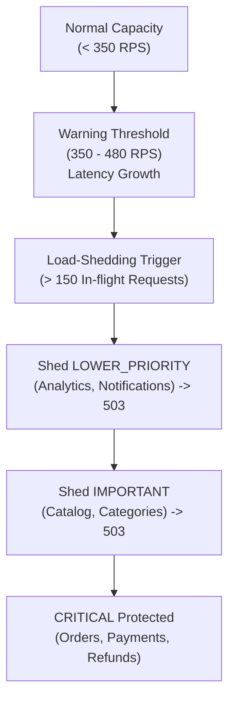

# Phase 6: System Failure Envelope & Degradation Analysis

## 1. Failure Envelope Architecture

The failure envelope characterizes how the platform degrades when traffic exceeds system capacity, ensuring failures are predictable, bounded, and non-destructive.

*All observations measured in local Docker environment.*

---

## 2. Resource Thresholds & Saturation Progression

---

## 3. Degradation & Bottleneck Progression

1. **First Bottleneck — Node.js Event Loop**:
   - At $\approx 480$ RPS aggregate ingress, the single Gateway process event loop begins queuing microtasks.
   - P95 increases from 65ms to 280ms.
2. **Second Bottleneck — PostgreSQL Order DB Write Contention**:
   - High concurrent order creation queues behind row-level locks in PostgreSQL.
   - Active DB pool connections climb to 18–25.
3. **Third Bottleneck — Load Shedding Threshold**:
   - In-flight requests cross 120 (80% of 150 max).
   - Gateway immediately responds to analytics and admin requests with `HTTP 503` + `Retry-After: 5` + `OVERLOAD_LOAD_SHED`.
   - Core checkout and payment routes continue operating without silent data loss.
4. **State Integrity**:
   - No duplicate orders created during overload.
   - Outbox events consistently persisted in the same transaction as business updates.
   - No database corruption or orphaned transactions observed.
